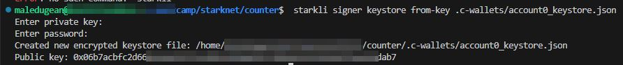
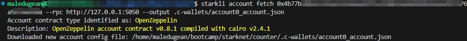
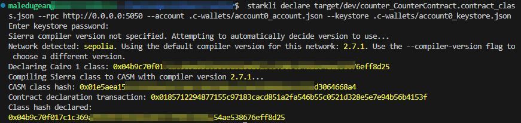
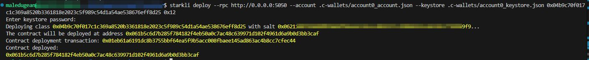
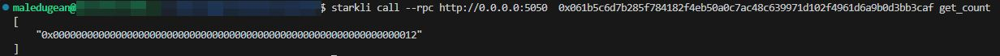
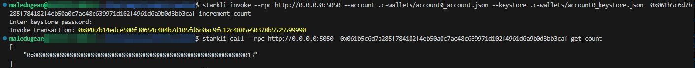

# Cairo Sample of Minimal contract using Starknet

## Table of Contents

-   [About](#about)
-   [Getting Started](#getting_started)
-   [Usage](#usage)
-   [License](#license)
-   [Notes](#notes)

## About 

This repository provides a minimal example of a Cairo smart contract deployed on Starknet. The contract demonstrates the basic structure and syntax of Cairo contracts.

## Getting Started 

### Prerequisites

-   **Starknet:** Ensure you have Starknet installed and configured on your system. ([https://starknet.io/](https://starknet.io/))
-   **Cairo compiler:** Install the Cairo compiler ([https://cairo-lang.org/](https://cairo-lang.org/))
-   **Starkli:** Install the command-line interface for interacting with the Starknet network ([https://book.starkli.rs/installation/](https://book.starkli.rs/installation/))
-   **Starknet Foundry:** toolchain for developing Starknet smart contracts ([https://github.com/foundry-rs/starknet-foundry/](https://github.com/foundry-rs/starknet-foundry/))

### Installing

1.  **Clone the repository:**

    Bash

        git clone https://github.com/your_username/cairo-minimal-contract.git

2.  **Compile the contract:**

    Bash

        scarb build

3.  **Create a folder to store your keys:**

    Bash

        cd cairo-minimal-contract
        mkdir .c-wallets

4.  **Start your starnet dev local:**

    Bash

        starknet-devnet --seed 2525635640

5.  **Create your signer:**

    Bash

        starkli signer keystore from-key .c-wallets/account0_keystore.json

    Sample:
    

6.  **Fetch Account:**

    Bash

        starkli account fetch < starknet-devnet AccountN > --rpc http://0.0.0.0:5050 --outpu < path-to-account >

    Sample:
    

7.  **Declare your contract:**

    Bash

        starkli declare “path-to-casm” --rpc http://0.0.0.0:5050 --account <path-to-account> --keystore   <path-to-keystore>

        Ex:
        starkli declare target/dev/counter_CounterContract.contract_class.json --rpc http://0.0.0.0:5050 --account .c-wallets/account0_account.json --keystore .c-wallets/account0_keystore.json

    Sample:
    

8.  **Deploy the contract:**

    Bash

        starkli deploy--rpc http://0.0.0.0:5050 --account <path-to-account> --keystore <path-to-keystore> <Class hash declared> Constructor_inputs
        Ex:
        starkli deploy--rpc http://0.0.0.0:5050 --account .c-wallets/account0_account.json --keystore .c-wallets/account0_keystore.json 0x04b9c70f017c1c369a8520b3361818e2023c5f989c54d1a54ae538676eff8d25 0x12

    Sample:
    

## Usage 

-   **Call functions:** Use the Starknet CLI or a Starknet-compatible wallet to call the contract's functions.

    **Get count**

    Bash

        starkli call --rpc http://0.0.0.0:5050  <hash contrato deployed> get_count
        Ex:
        starkli call --rpc http://0.0.0.0:5050  0x061b5c6d7b285f784182f4eb50a0c7ac48c639971d102f4961d6a9b0d3bb3caf get_count

    Sample:
    

    **Add count**

    Bash

        starkli invoke --rpc http://0.0.0.0:5050 --account <path-to-account> --keystore <path-to-keystore> <hash contrato deployed> increment_count
        Ex:
        starkli invoke --rpc http://0.0.0.0:5050 --account .c-wallets/account0_account.json --keystore .c-wallets/account0_keystore.json  0x061b5c6d7b285f784182f4eb50a0c7ac48c639971d102f4961d6a9b0d3bb3caf increment_count

    Sample:
    

## License 

This project is licensed under the Apache-2.0 License. See the LICENSE file for details.

## Notes 

**Additional Notes:**

-   This is a basic example. For more complex contracts, you can explore Cairo's features, such as storage, events, and function modifiers.
-   Refer to the Starknet documentation for more information on developing and deploying Cairo contracts.
-   Always audit your smart contracts before deploying them to a mainnet.
